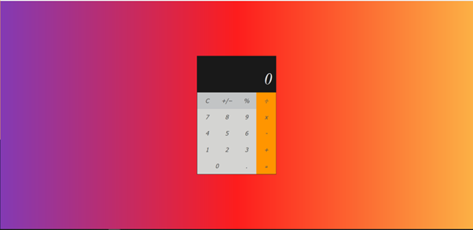
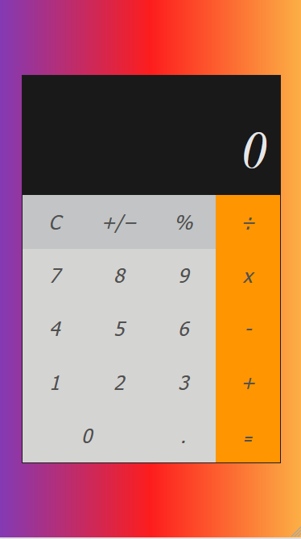

# Recreated Mac Calculator

This is my recreation of the Mac calculator. 
## Table of contents

- [Overview](#overview)
  - [The challenge](#the-challenge)
  - [Screenshot](#screenshot)
  - [Links](#links)
- [My process](#my-process)
  - [Built with](#built-with)
  - [What I learned](#what-i-learned)
  - [Continued development](#continued-development)

## Overview
This app is a recreation of the Apple Mac calculator. It allows users to do all the basic operations in maths. It also handles negative and decimal numbers. The app uses, CSS Grid and Flexbox for layout. It also uses Vanilla JavaScript to allow the functionality. 


### Challenges encountered
There were quite a few challenges I faced when doing this project but here were the hardest ones I found: 

- Allowing users to continually input numbers and operators beyond just two digits: 
e.g 44+44/2...
In this I faced the problem for a while of the numbers just  concatenating and the symbol being ignored e.g 44+44/2 would result in 44+442.

- Another challenge I faced was getting the sum to ignore when a double symbol was inputted, as it ended up causing calculations to run prematurely. 


### Screenshot




### Links

- Solution URL: [Add solution URL here](https://github.com/zach7815/Calculator)
- Live Site URL: [Add live site URL here](https://zach7815.github.io/Calculator/)

## My process
For this calculator, I focused on the HTML and CSS first, then moved onto the JavaScript. I focused, first on identifying what functions and features would needed, and wrote out what roughly each function would do and when and where they need to interact with one another. For this project I decided to use a object "defaultState" to track, store and set the different states of the calculator app. 


### Built with

-HTML5
-Flexbox
-Grid
-JavaScript


### What I learned
From this project I didn't learn any particularly new technologies or concepts. I was able to practice CSS grid and JavaScript callbacks. The main challenge from this app came in working out when and where to call functions, deciding what property was needed to be monitored in the object, and generally debugging unexpected behaviors that either my code or lack of code caused. 


```Css
/* The below CSS is not vastly new for me, but the use of word-wrap:break-word and word-break:break all, were new to me and saved me the headache of text overhanding the calculators display container */

.output {
  grid-column-end: span 4;
  color: var(--outputFont);
  background-color: var(--output);
  display: flex;
  align-items: flex-end;
  justify-content: space-around;
  flex-direction: column;
  padding: 10px;
  word-wrap: break-word;
  word-break: break-all;
  padding: 0 1rem 0 0;
  min-height: 7.1rem;
}
```


```js
// While not particulary new to me in usage or at all pioneering, the use of an object to track the state of the calculator was useful for my learning. I was able to better think modularly of what needs to happen to the data in the object at each step, and generally follow and practise the concepts of Object-orientated-programming. 

const defaultState = {
displayDigit:"0", 
prevOperand:"",
operator:null,
firstDigit:null, 
secondDigit:null, 
currentSum:""
}
```

### Continued development

I thoroughly enjoyed this project and what I learned and practiced in it. I plan next to revisit what I have learned about APIs and build a Weather Dashboard using Open Weather API, Node JS, Express and React. 

For my next project I think I would divide my HTML into more subsections like different rows for the calculator buttons. This would be useful practice to develop as while this project is small in the amount of its elements, larger projects following the current way I set it out would be a lot harder to read, organize and manipulate. 

